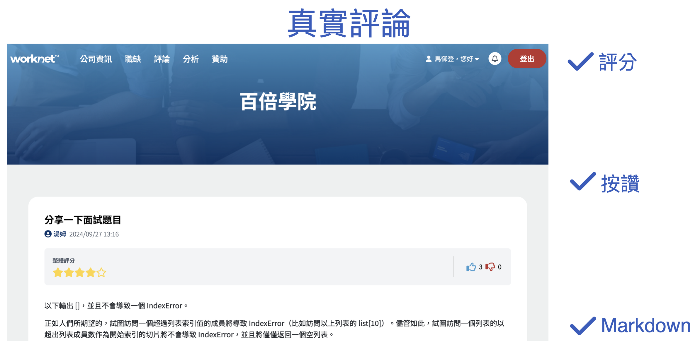

# WorkNet

  

<h3 align="center"> 
  WorkNet 助你求職風雨無阻
</h3>

<h3 align="center">
  掃描 QR Code，輕鬆分享公司資訊，快速申請理想職缺！
</h3>

  <a href="https://www.worknet.live/" target="_blank">專案網址</a>
  <a href="https://www.youtube.com/watch?v=hMIgF5R4Mv4" target="_blank">介紹影片</a>
  <a href="https://docs.google.com/presentation/d/1EY320eMV4_nVNOFEEplc_uCFrty2QN2rkABRQu-bug0/edit?usp=sharing" target="_blank">介紹簡報</a>

## 簡介

WorkNet 是一個求職平台，並可讓使用者瀏覽面試經歷與工作心得，了解公司環境與文化。

使用者可以上傳履歷並投遞應徵職缺，並與其他會員留言互動，分享面試技巧和工作經驗，打造一個真實的求職社群，幫助大家在職涯中做出更明智的決策。

公司方可以新增職缺跟管理職缺，接收投遞履歷並發送面試邀約。

## 功能說明

### 使用者功能：

1. 選擇程式語言：使用者可選擇自己熟悉或正在使用的程式語言。
2. 上傳與投遞履歷：使用者可上傳履歷並將其投遞至感興趣的職缺。
3. 公司評論與評分：使用者可對公司進行評分並留下評論，分享工作經驗。
4. 接收面試邀約：使用者可接收來自公司的面試邀約。

### 公司功能：

1. 建立職缺：公司可依照需求及程式語言發佈職缺，招募符合條件的工程師。
2. 接收與管理投遞履歷：公司可接收投遞的履歷並進行篩選與管理。
3. 發送面試邀約：公司可向符合條件的應徵者發送面試邀約。
4. 公司資訊顯示 Google 地圖：公司資料中包含 Google Maps，讓使用者查看公司位置。

### 評論功能：

1. 公司評論：使用者可以針對各公司進行獨立的評價，並留下文字評論，支援 Markdown 語法。
2. 評分機制：使用者可以為公司給予分數，評分項目包括工作環境、薪資待遇、公司文化等。
3. 留言互動：使用者可以針對其他人的評論進行回應或給予反饋（如：按讚或反對）。

### 分析功能：

1. 程式語言分析：
   - 依照使用者數量分析各程式語言的使用情況。
   - 依照職缺數量分析各程式語言的需求。
2. 平均薪資分析：依據不同程式語言顯示平均薪資資訊。
3. 年資分析：顯示各程式語言對應的平均年資。
4. 地區職缺分析：顯示每種程式語言在不同地區的職缺數量。

### 金流贊助功能：

1. 使用者贊助：使用者可以通過網站向特定公司或項目進行贊助，支持他們的發展。
2. 安全支付系統：整合安全的金流系統，保障贊助交易的安全性與隱私。

### 額外功能：

- 簡易的使用者介面切換：依據使用者或公司身份切換前後端介面。

## 安裝環境

1. `git clone https://github.com/astrocamp/17th-WorkNet.git`(將專案複製到本地)
2. `cd 17th-WorkNet`(進入專案目錄)
3. `poetry install`(安裝 Poetry 相關套件)
4. `npm install`(安裝 npm 相關套件)
5. 建立`.env`(設定環境變數)

## 執行環境

- `npm run dev`

## 技術使用

- 前端：daisyUI, TailwindCSS, Alpine.js, HTMX
- 後端：Python, Django
- 資料庫：PostgreSQL
- 版本控制：Git
- 第三方登入：Google, Line
- 履歷上傳：Amazon Web Services (AWS) S3
- 郵件發送：Mailgun
- 部署：Heroku
- 規劃：Miro, Trello

## 團隊成員

- 黃信愷 [GitHub](https://github.com/KK-Huang86)
  - Line Pay 第三方金流
  - Google 第三方登入
  - 分類標籤功能
  - 應徵職缺功能
  - 收藏公司功能
- 馬御登 [GitHub](https://github.com/RDNNNNN)
  - 分析功能
  - 會員系統
  - 忘記密碼
  - 郵件發送
  - 公司 & 職缺關聯
- 江東橙 [GitHub](https://github.com/DongOrange)
  - 權限系統
  - 分頁功能
  - 專案網頁設計
  - 評論 & 會員關聯
- 丁敬嘉 [GitHub](https://github.com/Ellen9543)
  - Line 第三方登入
  - 文章按讚
  - 通知系統
  - 提示訊息
  - 應徵紀錄
  - 會員 & 會員資訊關聯
  - 會員 & 留言關聯
- 吳菁菁 [GitHub](https://github.com/kait-wu)
  - Heroku 部署
  - 履歷、圖片上傳(AWS S3)
  - 評論功能
  - 搜尋功能
  - 公司 & 評論關聯
- 古佳翰 [GitHub](https://github.com/Gujiahan)
  - Google Map 串接
  - 收藏職缺功能
  - 公司查看應徵履歷功能
  - 登入後轉址原頁面
  - 使用者 & 履歷關聯
